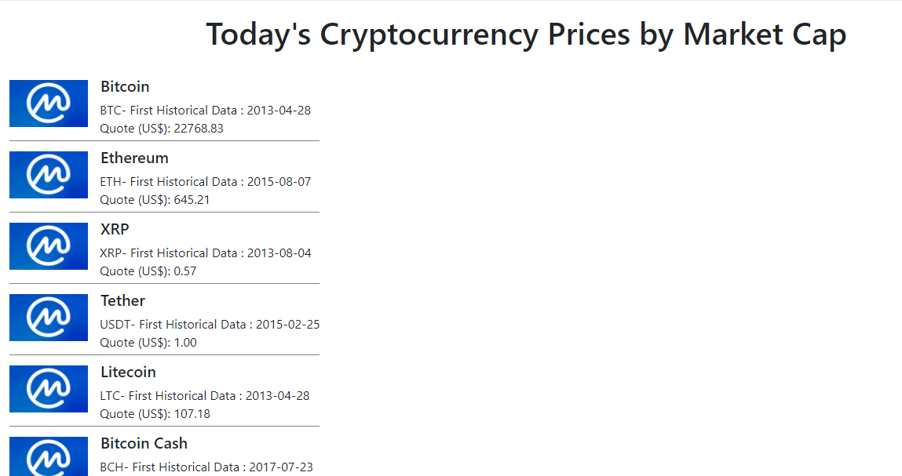

# Coin Market Cap API Test

A test in HTML/CSS/JS for handle the API of Coin Market Cap. This is a basic implementation based on the lessons of [Bárbara Casac](https://github.com/bahcasac) available on [Digital Innovation One](https://digitalinnovation.one/ "Digital Innovation One"). For the future, I plan to implement other features.

  

### Requirements

* This is a code for testing and debugging. It is recommended that you use a backend language to manipulate the API. In this case, as we use Javascript, you must install [Moesif Origin & CORS Changer](https://chrome.google.com/webstore/detail/moesif-origin-cors-change/digfbfaphojjndkpccljibejjbppifbc) or similar.
* You need a API Key from the [Coin Market Cap](https://coinmarketcap.com/api/). Insert the key in JS code.

