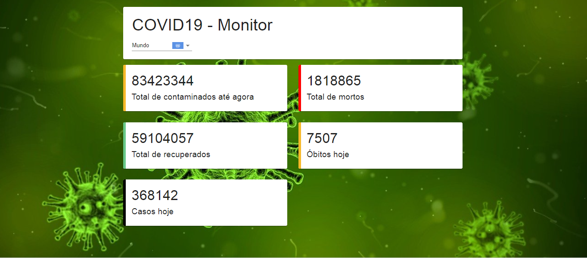

# COVID-19 Monitor 

A simple app developed in ReactJS based on the course of [Bruno Carneiro](https://github.com/Tautorn/covid19-dio) on [Digital Innovation One](https://digitalinnovation.one/ "Digital Innovation One")
The proposal uses data from https://coronavirus-19-api.herokuapp.com/ and organize information in a structured display.

	

## Use 
- Download and unzip the Covid-19 Monitor. 
- Enter the unzipped folder and run *yarn start*. Open  http://localhost:3000 in your browser to access the app. 
- Use *yarn build*: this command builds a version of the app for production in the build folder.
